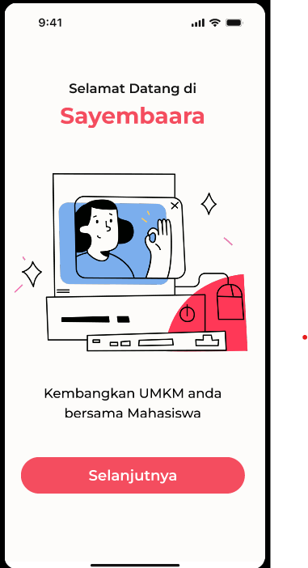
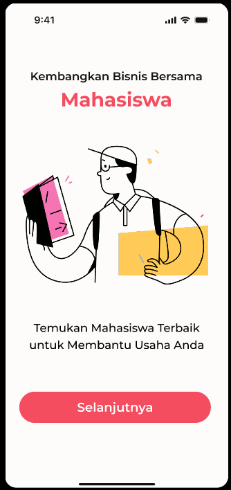
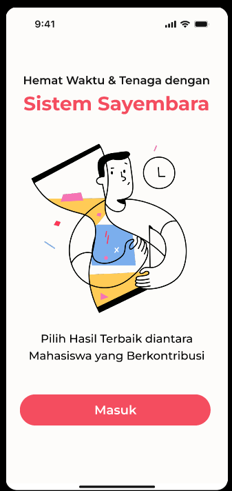
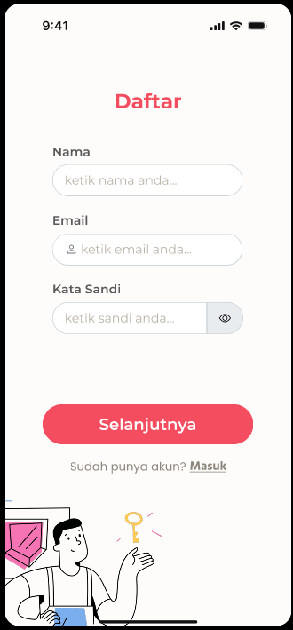
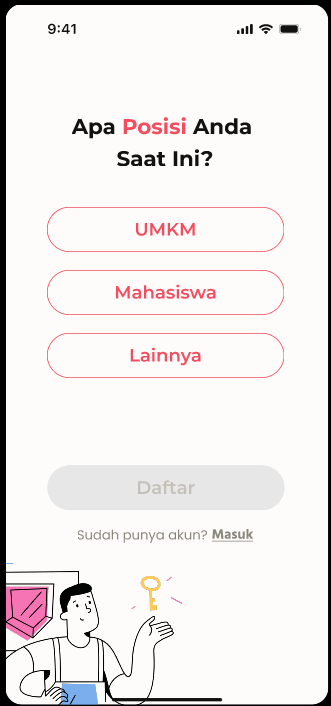
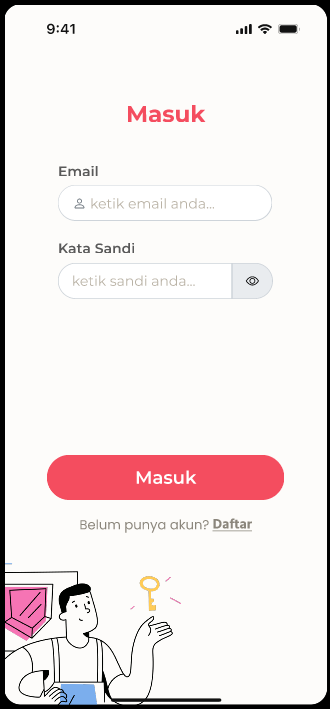

# Sayembaara

Sayembaara adalah platform yang mempertemukan UMKM dan mahasiswa untuk bekerja sama mengembangkan usaha kecil di Indonesia.

Dimana UMKM memberikan lapangan serta tenaga kerja, sementara mahasiswa berkontribusi dengan kreativitas mereka.

# links

http://34.101.201.141/

# Mockups

# Team

### Faishal Zufari as Hacker

### Mayangkasih Arynsyah S.B as Hipster

### Nafil Valencio Irwan as Hustler

### Muhammad Kasyfil Aziz as Hacker

# Web App Mobile

