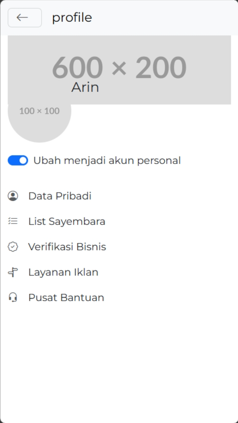

# Sayembaara

Sayembaara adalah platform yang mempertemukan UMKM dan mahasiswa untuk bekerja sama mengembangkan usaha kecil di Indonesia.

Dimana UMKM memberikan lapangan serta tenaga kerja, sementara mahasiswa berkontribusi dengan kreativitas mereka.

# Mockup Figma: https://www.figma.com/proto/yKmDah3R0TJgtop4vspH48/Paracetamol-Design-Area?type=design&node-id=99-168495&t=c5Q2hiz3OP3KC3uN-1&scaling=min-zoom&page-id=98%3A56306&starting-point-node-id=99%3A168495&mode=design

# Team

### Faishal Zufari as Hacker

### Mayangkasih Arynsyah S.B as Hipster

### Nafil Valencio Irwan as Hustler

### Muhammad Kasyfil Aziz as Hacker

# Web App Mobile

